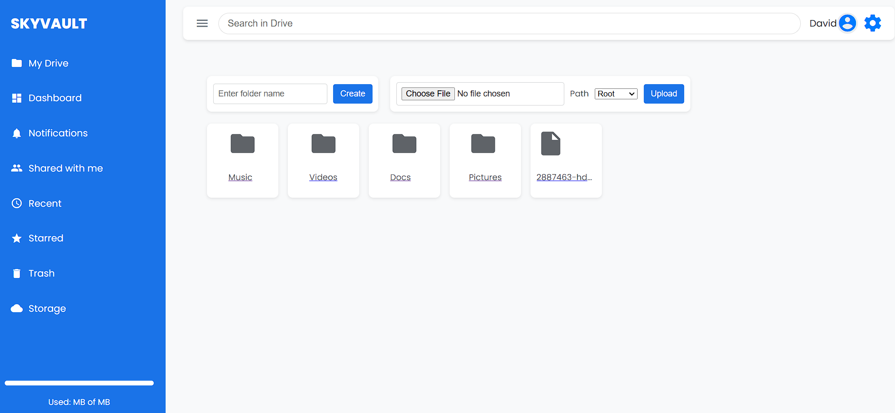
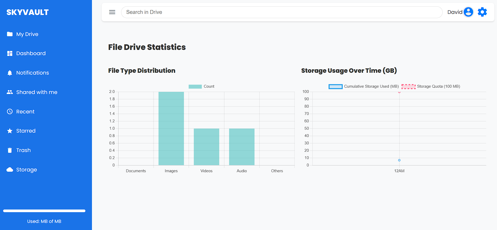
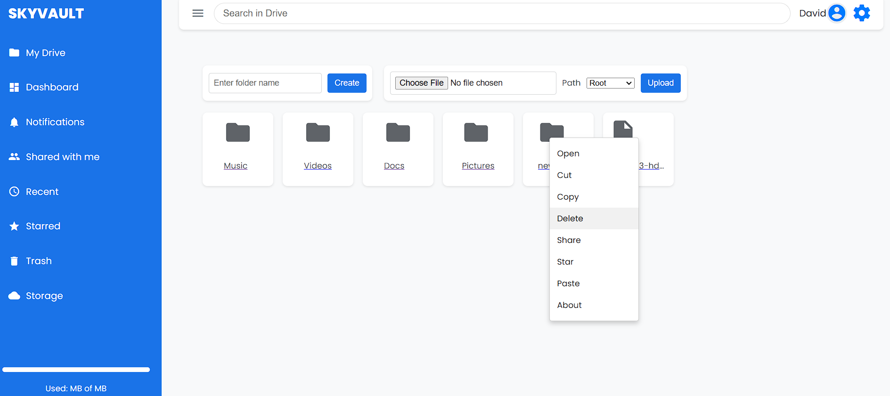
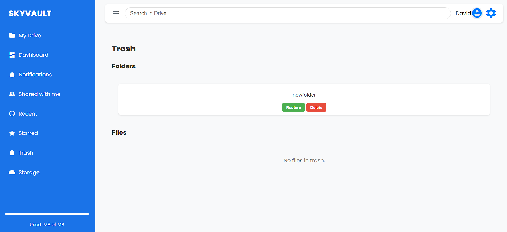
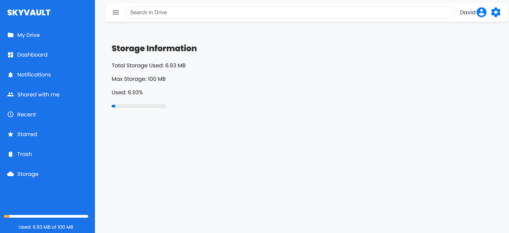

---

# 🌌 SkyVault

SkyVault is a file management and storage application that brings cloud-like functionalities to your server. Manage, organize, and securely store files and folders with ease. This project allows users to perform actions like uploading, deleting, restoring, and starring files, along with intuitive navigation features such as context menus and a dashboard overview.

---

## 🚀 **Features**

- **Upload & Manage Files**: Seamlessly upload, organize, and manage files and folders.
- **Context Menu**: Right-click on files and folders to access quick actions.
- **Dashboard Overview**: Get an insight into storage usage and recent activity.
- **Trash & Restore**: Deleted items are stored in the Trash for easy recovery.
- **Starred Items**: Mark important files and folders to access them quickly.

---

## 🛠️ **Getting Started**

SkyVault can be run in two ways: using Docker or directly on your local environment.

### Option 1: Run with Docker

1. Ensure Docker is installed on your machine.
2. Build and run the Docker containers:
   ```bash
   docker-compose up --build
   ```
3. Access the application at [http://localhost:8000](http://localhost:8000) or  [http://127.0.0.1:8000](http://127.0.0.1:8000).

---

### Option 2: Run Locally (Development Mode)

1. **Install Python and pip:**
   Ensure Python and pip are installed on your machine. [Download Python here](https://www.python.org/downloads/), if needed.

2. **Create and Activate a Virtual Environment:**
   ```bash
   python -m venv .venv
   ```

   - **Activate the virtual environment:**
     - **Windows:** 
       ```bash
       .venv\Scripts\activate
       ```
     - **MacOS/Linux:**
       ```bash
       source .venv/bin/activate
       ```

3. **Install Dependencies:**
   With the virtual environment activated, install the required dependencies:
   ```bash
   pip install -r requirements.txt
   ```

4. **Set Up Database:**
   If running locally, use the SQLite database by uncommenting the relevant section in `settings.py`.

5. **Run Migrations:**
   ```bash
   python manage.py migrate
   ```

6. **Create a Superuser (optional for admin access):**
   ```bash
   python manage.py createsuperuser
   ```

7. **Start the Development Server:**
   ```bash
   python manage.py runserver
   ```

8. **Access the Application:**
   Open your browser and go to [http://127.0.0.1:8000](http://127.0.0.1:8000) to access the application.

---

## 🖼️ **Screenshots**

Take a look at some screenshots of SkyVault in action:

### 1️⃣ **Home Screen**


> *The main interface where you can see your files and folders.*

### 2️⃣ **Dashboard**


> *Get an overview of your storage usage and recent activity.*

### 3️⃣ **Context Menu**


> *Right-click to see various actions you can perform on files and folders.*

### 4️⃣ **Trash**


> *Deleted items are stored here, allowing you to restore or permanently delete them.*

### 5️⃣ **Info Panel**


> *Access detailed information and usage statistics for your account.*

---

## 📜 **Environment Variables**

To configure the project, create a `.env` file with the following environment variables:

```env
SECRET_KEY=your_secret_key
DEBUG=True
DB_NAME=your_database_name
DB_USER=your_database_user
DB_PASSWORD=your_database_password
DB_HOST=your_database_host
DB_PORT=your_database_port
ALLOWED_HOSTS=localhost,127.0.0.1
```

---

## 📝 **License**

SkyVault is licensed under the MIT License.

--- 
