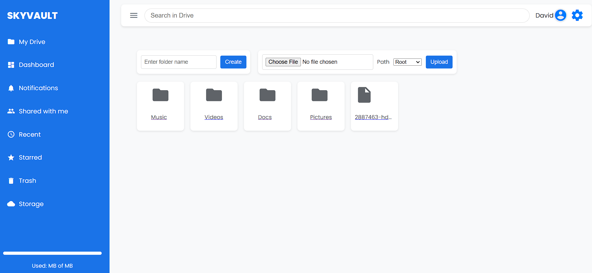
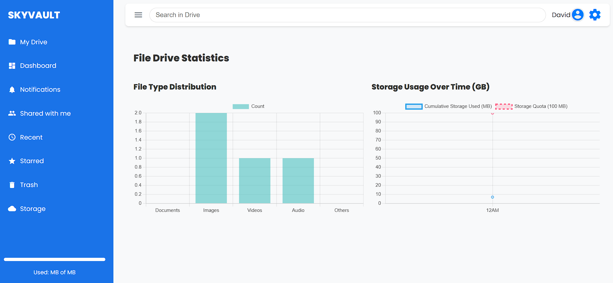
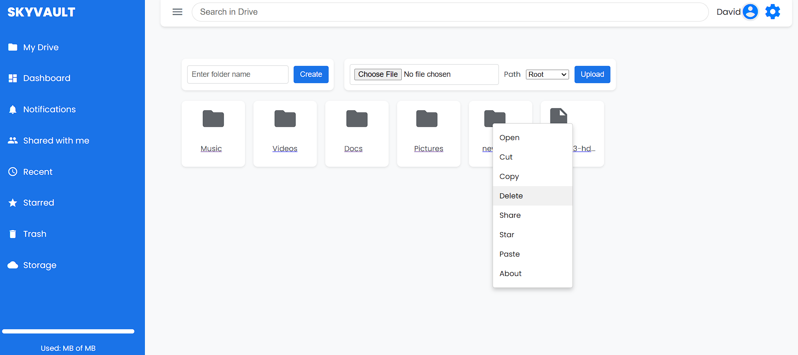
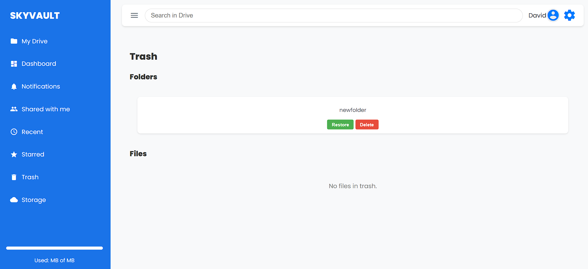
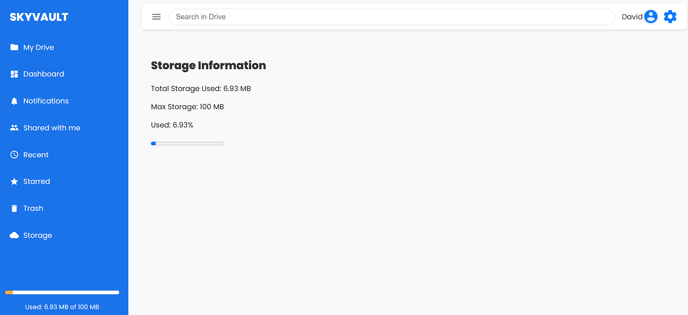
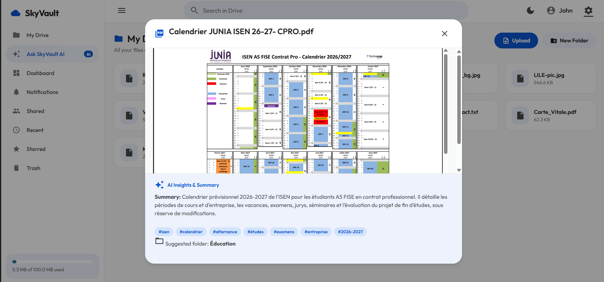
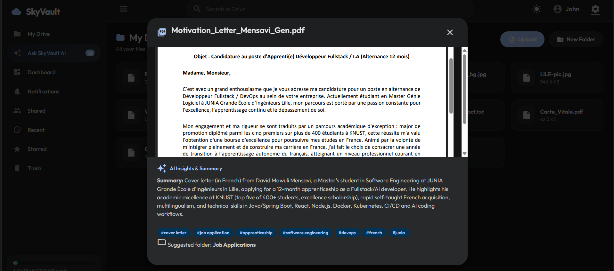
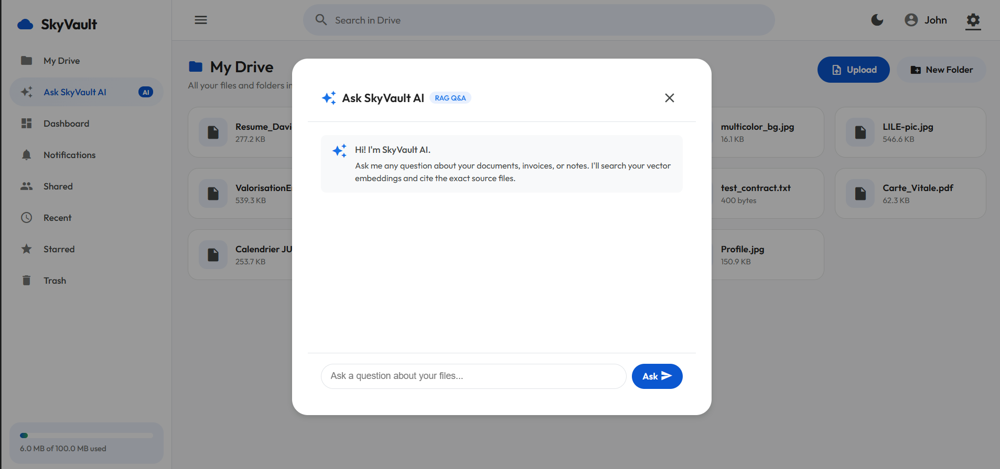
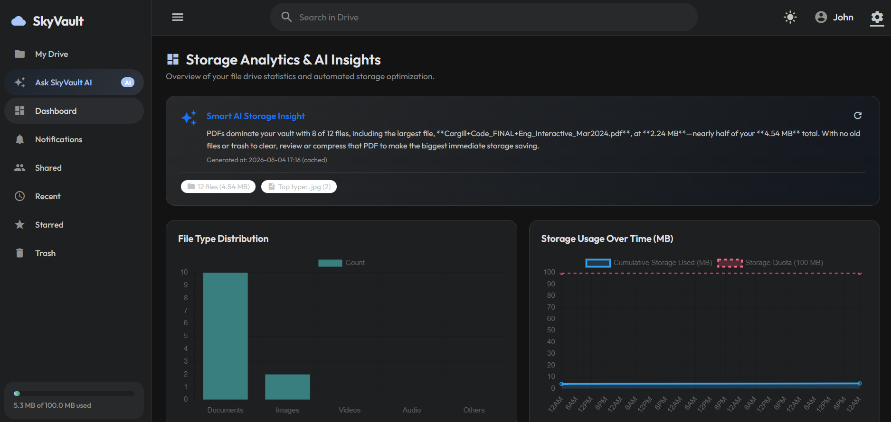
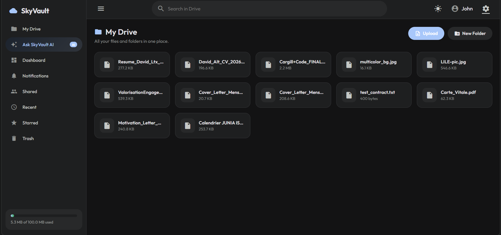

---

# 🌌 SkyVault

SkyVault is a file management and storage application that brings cloud-like functionalities to your server. Manage, organize, and securely store files and folders with ease. This project allows users to perform actions like uploading, deleting, restoring, and starring files, along with intuitive navigation features such as context menus and a dashboard overview.

---

## 🚀 **Features**

- **Upload & Manage Files**: Seamlessly upload, organize, and manage files and folders.
- **Context Menu**: Right-click on files and folders to access quick actions.
- **Dashboard Overview**: Get an insight into storage usage and recent activity.
- **Trash & Restore**: Deleted items are stored in the Trash for easy recovery.
- **Starred Items**: Mark important files and folders to access them quickly.

---

## 🛠️ **Getting Started**

SkyVault requires **PostgreSQL** (with the `pgvector` extension for upcoming AI features). You can run Postgres via Docker or install it locally.

See [docs/ROADMAP.md](docs/ROADMAP.md) for the full AI implementation plan.

### Option 1: Run with Docker (recommended)

1. Ensure Docker is installed on your machine.
2. Build and run the Docker containers:
   ```bash
   docker-compose up --build
   ```
   This starts the app and a PostgreSQL 16 instance with `pgvector` pre-enabled via `scripts/init_pgvector.sql`.
3. Create an admin user (in a second terminal):
   ```bash
   docker-compose exec web-skyvault python manage.py createsuperuser
   ```
4. Access the application at [http://localhost:8000](http://localhost:8000) or [http://127.0.0.1:8000](http://127.0.0.1:8000).

> **Note:** The pgvector init script runs only on a **fresh** database volume. If you previously ran SkyVault with plain Postgres, reset the volume first:
> ```bash
> docker-compose down -v
> docker-compose up --build
> ```

---

### Option 2: Run Locally (Development Mode)

1. **Install PostgreSQL 16+** with the [pgvector extension](https://github.com/pgvector/pgvector) enabled:
   ```sql
   CREATE EXTENSION IF NOT EXISTS vector;
   ```
   Create a database (e.g. `skyvault` or `postgres`).

2. **Install Python and pip** ([Download Python](https://www.python.org/downloads/) if needed).

3. **Create and activate a virtual environment:**
   ```bash
   python -m venv .venv
   ```
   - **Windows:** `.venv\Scripts\activate`
   - **MacOS/Linux:** `source .venv/bin/activate`

4. **Install dependencies:**
   ```bash
   pip install -r requirements.txt
   ```

5. **Configure environment variables** — copy settings into a `.env` file (see [Environment Variables](#-environment-variables) below). For local dev, use `DB_HOST=localhost`.

6. **Run migrations:**
   ```bash
   python manage.py migrate
   ```

7. **Create a superuser (optional):**
   ```bash
   python manage.py createsuperuser
   ```

8. **Start the development server:**
   ```bash
   python manage.py runserver
   ```

9. Open [http://127.0.0.1:8000](http://127.0.0.1:8000).

> **Legacy SQLite fallback:** Set `DB_ENGINE=sqlite` in `.env` to use SQLite. This disables pgvector and AI features.

---

## 🖼️ **Screenshots**

Take a look at some screenshots of SkyVault in action:

### 1️⃣ **Home Screen**


> *The main interface where you can see your files and folders.*

### 2️⃣ **Dashboard**


> *Get an overview of your storage usage and recent activity.*

### 3️⃣ **Context Menu**


> *Right-click to see various actions you can perform on files and folders.*

### 4️⃣ **Trash**


> *Deleted items are stored here, allowing you to restore or permanently delete them.*

### 5️⃣ **Info Panel**


> *Access detailed information and usage statistics for your account.*

---

## AI Features 🧠

SkyVault integrates AI for smart file management. Upload a document and receive auto-generated tags, summaries, and folder suggestions. Ask natural-language questions about your files with RAG-powered search.

### Features

- **Auto-tagging & Summarization** — AI analyzes uploaded PDFs, text, and markdown files to extract summaries, tags, and suggested folders.
- **Semantic Search** — Find files by meaning, not just filename. Queries are embedded and matched against document chunks via pgvector cosine similarity.
- **Ask Your Vault (RAG Q&A)** — Submit natural-language questions and receive grounded answers with source file citations.
- **Storage Insights** — AI-generated natural-language summary of your vault contents, available on the dashboard.

### How It Works

1. Upload a supported file (`.pdf`, `.txt`, `.md`)
2. A background task extracts text and sends it to Claude for analysis
3. Text is chunked into paragraphs, embedded via OpenAI, and stored in pgvector
4. Semantic search and RAG queries retrieve relevant chunks and generate answers using Claude

### Required API Keys

Set these in your `.env` file:

```env
# Generation — Anthropic-compatible endpoint.
# Leave ANTHROPIC_BASE_URL empty to use api.anthropic.com directly,
# or point it at a compatible gateway (e.g. AgentRouter).
ANTHROPIC_AUTH_TOKEN=sk-...
ANTHROPIC_BASE_URL=https://agentrouter.org
ANTHROPIC_MODEL=claude-opus-5

# Embeddings — requires a real OpenAI key.
# Gateways generally do not serve /v1/embeddings.
OPENAI_API_KEY=sk-...
```

Optional overrides:

```env
# Fallback generation model, used only if the primary endpoint is unset or errors.
# Same Anthropic-compatible API; leave AI_FALLBACK_MODEL empty to disable.
AI_FALLBACK_MODEL=gpt-5.6-sol
AI_FALLBACK_API_KEY=sk-...
AI_FALLBACK_BASE_URL=https://agentrouter.org

OPENAI_BASE_URL=
AI_EMBEDDING_MODEL=text-embedding-3-small
AI_EMBEDDING_DIMENSIONS=1536
```

Verify your configuration with:

```bash
python manage.py ai_smoke_test
```

### Running the Evaluation

The retrieval system includes a Recall@K benchmark. To run it:

```bash
# Ensure you have a user with files in the database, then:
python manage.py run_search_eval
```

Results are written to `docs/EVAL_RESULTS.md`.

### Screenshots

#### AI Insights & Summary — File Preview


> *Opening a PDF shows the AI-generated summary, tag chips, and a suggested folder alongside the document preview.*

#### AI Insights in Dark Mode


> *The same panel in dark mode — a cover letter summarized into tags (`#cover letter`, `#apprenticeship`, `#devops`) with `Job Applications` suggested as its folder.*

#### Ask SkyVault AI (RAG Q&A)


> *The Ask SkyVault AI dialog. Questions are answered from your own documents by searching vector embeddings, with the exact source files cited.*

#### Storage Analytics & AI Insights


> *The dashboard pairs the Smart AI Storage Insight card — a natural-language read on what is taking up space and what to do about it — with file type and storage usage charts.*

#### My Drive (Dark Mode)


> *The vault in dark mode, with Ask SkyVault AI available from the sidebar.*

---

## 📜 **Environment Variables**

Create a `.env` file in the project root:

```env
SECRET_KEY=your_secret_key
DEBUG=True
ALLOWED_HOSTS=localhost,127.0.0.1

# PostgreSQL (required)
DB_NAME=skyvault
DB_USER=postgres
DB_PASSWORD=postgres
DB_HOST=localhost
DB_PORT=5432

# Optional: DB_ENGINE=sqlite for legacy SQLite fallback (no AI features)
```

---

## 📝 **License**

SkyVault is licensed under the MIT License.

--- 
