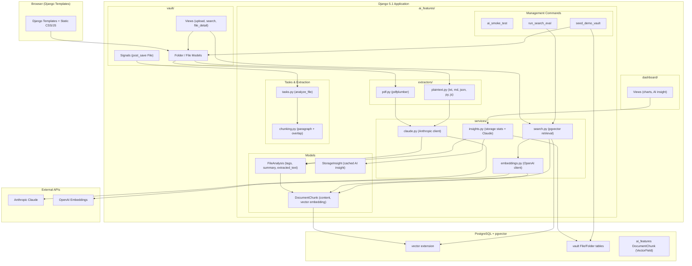

# SkyVault Architecture

## Overview

SkyVault is a Django-based personal file vault with AI-powered features including auto-tagging, semantic search, RAG Q&A, and storage insights.

## Architecture Diagram

## RAG Pipeline Walkthrough

1. **Upload**: User uploads a `.pdf` file. Non-PDF uploads are rejected. The `File` record is created, and a `post_save` signal fires.

2. **Signal → Task**: The signal enqueues `ai_features.tasks.analyze_file(file_id)` via django-q2 (async background task).

3. **Text Extraction & Page Sampling**: `analyze_file` calls `extract_text()` which dispatches to the appropriate extractor:
   - **PDF** (`.pdf`): `pdf.py` via pdfplumber. If the PDF has more than 10 pages, only the first 5 and last 5 pages are extracted to respect token limits.
   - **Word Documents** (`.docx`, `.doc`): `docx.py` via python-docx; extracts all paragraphs and table cells.
   - **Images** (`.jpg`, `.jpeg`, `.png`, `.gif`, `.bmp`, `.tiff`, `.webp`): `image.py` via pytesseract OCR; enables extraction of text from scanned documents and screenshots.
   - **Plaintext** (`.txt`, `.md`, `.json`, `.py`, `.js`, `.html`, `.css`, `.csv`, `.xml`): `plaintext.py` with encoding fallbacks (utf-8, latin-1, cp1252).
   - **Audio / Video**: Blocked at upload (views.py + forms.py) and never reach the extraction layer.

4. **AI Analysis**: The extracted text (truncated to 8000 chars) is sent to Anthropic Claude with a structured JSON prompt. Claude returns:
   - `summary`: 2-3 sentence summary
   - `tags`: 3-7 lowercase tags
   - `suggested_folder`: a folder name

5. **Chunking & Embedding** (Phase 2): The full extracted text is chunked using `chunking.py` (paragraph-based split with overlap), then each chunk is embedded via OpenAI `text-embedding-3-small` (1536 dims) and stored as `DocumentChunk` records with pgvector `VectorField`.

6. **Semantic Search**: When a user submits a search query:
   - The query is embedded via OpenAI
   - pgvector performs cosine distance search over `DocumentChunk.embedding`
   - Results are scoped to `file__user=request.user` and `file__trashed=False`
   - Top-k chunks are deduplicated back to files and returned with relevance scores

7. **RAG Q&A** (`/vault/ask/`):
   - Retrieve top-5 relevant chunks (same as search)
   - Build a context block with file citations `[1] filename.pdf: "...chunk..."`
   - Send the context + user question to Claude
   - Claude generates an answer citing the source files

## Chunking Strategy

**Paragraph-based chunking with overlap** (in `ai_features/chunking.py`):

1. **Primary split**: On double-newline paragraph boundaries (`\n\n`). This preserves coherent semantic units (sentences, ideas, code blocks) that would be broken by naive fixed-character splits.

2. **Max chunk size**: 2000 characters (~500 tokens). Chunks are capped at this size to stay within embedding model context windows and produce dense, relevant vectors.

3. **Overlap**: 200 characters (~50 tokens) between consecutive chunks. Overlap ensures that boundary-content near chunk breaks is represented in adjacent chunks, preventing retrieval misses for queries that span chunk boundaries.

4. **Min chunk merge**: Fragments smaller than 50 characters are merged into the preceding chunk to prevent vector noise from near-empty chunks.

5. **Long paragraph handling**: If a single paragraph exceeds 2000 chars, it is sub-split on sentence boundaries (`[.!?]\s+`) with the same overlap logic.

### Why not fixed-size character splitting?

Fixed-size splits (e.g., every 500 characters) break mid-sentence and mid-code-block, destroying semantic context. For example, a query about "tax deduction" would fail if the splitting boundary falls between "tax" and "deduction." Paragraph splitting keeps semantically coherent units intact.

## Embedding Model Choice

| Decision | Choice | Rationale |
|----------|--------|-----------|
| Embedding model | `text-embedding-3-small` | Cheapest OpenAI embedding model; 1536 dimensions; well-documented |
| Dimensions | 1536 | Matches the model default; no compression needed |
| Vector store | pgvector (PostgreSQL) | Already on the same database; no additional infrastructure |
| Index type | HNSW (Cosine) | Best recall/speed tradeoff for pgvector; supported natively |

## Evaluation Results

Benchmark queries are stored in `ai_features/eval/queries.json`. Recall@k is computed by checking whether expected files appear in the top-k results.

Run baseline: `python manage.py run_search_eval`

See `docs/EVAL_RESULTS.md` for latest numbers.

## Key Design Decisions

- **No LangChain/LangGraph**: Hand-rolled RAG loop for full control and portfolio differentiation.
- **Django templates (not DRF)**: Server-rendered UI keeps the project simple and interview-friendly.
- **django-q2 ORM broker**: No Redis required for dev; sufficient for portfolio scale.
- **Per-user isolation**: All retrieval queries filter by `file__user=request.user`.
- **Async processing**: Upload returns immediately; AI analysis runs in background via django-q2.